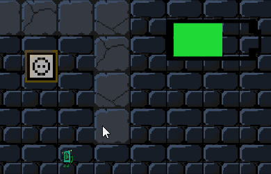
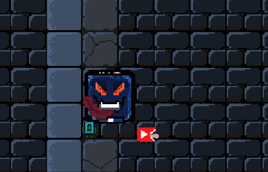

# Electrodungeon - GT2 ROGUELIKE

## WIKI

more information and documentation of the development process can be found in our github WIKI !

* Game Idea: https://github.com/daaning/GT2roguelike/wiki/Spielidee:-Electro-Dungeon

## Play 

- Play electrodungeon for windows download from our releases page

## Features

### charge that phone!
Juice that old battery back up and keep fighting those annoying pop ups and applications, defing death for just a bit longer :)

### dugeon generator:
To show off the dungeon the creator has just randomly generated for you we have build a camera module that's shows the generatation of the path towards the end and the rest of the dungeon. Hope you can figure out where to charge and how to conserve energy before it's too late and the pop ups win again.

### Appalicious NomNomNOm
These apps are getting hungerier by the day, run fast before appalicious installs some updates and absolutely destroy your battery

### iphonius maximus:
Next to our "regular" enemies we have an gruesome boss battle against the great iphonius maximus who is your replacement and you should at the very least break it's screen or empty it's battery before yours runs out.

## Projects
See what we are currently developing and will be added to the game soon

Game built for Game Engines Course @ HTW Berlin 

We hope you have fun playing we sure did building :)
